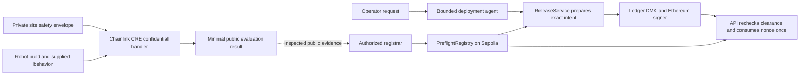
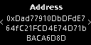

# Preflight [STILL IN DEVELOPMENT]

## A confidential deployment gate for autonomous warehouse robots

Preflight answers one practical question before a robot is released:

> Did this exact robot software build pass this site's private evaluation rules, and has an authorized human approved this exact release?

It combines confidential evaluation with hardware-backed approval. The factory does not need to
publish its private safety envelope, and the deployment agent cannot approve a release by itself.

**Built for ETHGlobal From Scratch with Chainlink CRE and Ledger as load-bearing integrations.**

> **Current status:** P1–P7 software is implemented and the product UI flow is now present: landing,
> onboarding, workspace setup, build selection, evaluation, release preparation, evidence, and the
> human Ledger handoff. The Sepolia registry, deterministic evaluator, authenticated CRE simulation
> path, bounded deployment agent, and offline rehearsal remain in place. Physical Ledger/Clear
> Signing evidence, a live DON run, an external model run, and P8 submission assets remain open.

[Judge path](#try-the-judge-demo) · [How it works](#how-it-works) · [Partner proof](#partner-integrations) · [Testing](#testing) · [Known limits](#current-status-and-known-limits)

## In one minute

### Who is this for?

- A factory or warehouse safety engineer.
- A robot vendor or systems integrator deploying an autonomous mobile robot (AMR).
- A team that needs to cooperate across company boundaries without sharing every private detail.

### What problem does it solve?

A factory knows sensitive facts about its site: restricted zones, worker-only areas, speed limits,
payload limits, and emergency paths. A robot vendor has proprietary software and models. Both sides
still need evidence that a particular software build can be evaluated against that particular site.

A normal shared database does not solve the trust problem well when the parties do not want to give
each other their private rules or software internals. A generic AI agent also cannot be the final
authority for a high-impact physical action.

### What did we build?

We built Preflight for the moment when a robot vendor and a factory need to trust the same result
without sharing everything with each other.

Preflight creates a versioned clearance for an exact combination of:

`site + robot + build + safety-envelope commitment + evaluator version + expiry`

The safety result is deterministic. A deployment agent can explain the result and prepare a release,
but a human must approve the exact deployment intent with Ledger hardware before the release gate can
report authorization.

### Why it matters

Preflight is not a robot controller, a robot marketplace, or a generic wallet agent. It is a
**proof-to-deploy boundary** for autonomous software entering a physical environment.

The first wedge is cross-company warehouse AMR deployment. The same pattern could later support
industrial cobots, forklifts, inspection drones, or other autonomous machines, but this MVP stays
focused on one warehouse story.

## The problem in plain language

Consider a vendor deploying `robot-build:corrected-v1` to `site:demo-warehouse`.

The warehouse may not want to reveal:

- the complete floor geometry;
- human-only and machine-only zones;
- speed and payload thresholds;
- emergency routes; or
- the full set of private test scenarios.

The vendor may not want to reveal model weights, planning logic, or controller internals.

Preflight lets the evaluator use those inputs without turning the private envelope into a public
database record. It publishes only the minimum result and exact binding needed for a later release
decision.

Passing a simulation is **not** a claim that a robot is physically safe. It means only that the exact
build passed the specified evaluation envelope. Physical commissioning and operational controls are
still required.

## The solution

Preflight has three separate authorities:

1. **Deterministic evaluator** — computes `CLEAR` or `HOLD` from versioned inputs. An LLM cannot
   change the safety verdict.
2. **Public attestation** — records public hashes, bindings, verdict, issuer, and expiry in a small
   Sepolia registry. Private site data does not go onchain.
3. **Human release gate** — prepares the exact EIP-712 deployment intent, then requires the human
   operator's Ledger approval. The backend never receives the hardware key.

Changing the build ID or artifact digest changes the binding. The old clearance cannot be reused.

## How it works



### Step by step

1. The site defines a versioned safety envelope. Its rules, geometry, thresholds, and commitment
   blind are private inputs.
2. The vendor identifies one exact robot build and supplies the behavior needed for the evaluation.
3. The Chainlink CRE workflow reads the confidential envelope inside its `handlerInTee` callback and
   calls the deterministic simulation core.
4. Only a minimal result leaves the confidential boundary. An authorized registrar can attest the
   public binding in the Sepolia registry; the current implementation does not claim automatic
   CRE-to-EVM delivery.
5. The deployment agent reads public evaluation and clearance state and calls the existing
   `ReleaseService.prepare()` authority. It cannot sign, consume, write the registry, or invent a
   clearance.
6. Ledger displays and signs the exact deployment intent on the human operator's device.
7. The API recovers the signer, checks the exact registry state again, and consumes the nonce once.

## What stays private and what becomes public

| Boundary                 | Data                                                                                 | Rule                                                                           |
| ------------------------ | ------------------------------------------------------------------------------------ | ------------------------------------------------------------------------------ |
| Confidential evaluation  | Site envelope, blind, private rules, geometry, thresholds, and intermediate evidence | Used inside the CRE confidential callback; never logged or sent to the browser |
| Public evaluation result | Version, verdict, evaluation ID, build/site bindings, and a behavior-input digest    | Minimal result only; it does not reveal the private envelope                   |
| Sepolia registry         | Public hashes, exact bindings, `CLEAR`, issuer, timestamps, and revocation state     | No private rules or confidential payloads                                      |
| Ledger release           | Full deployment intent, including exact build, clearance, signer, nonce, and expiry  | Human confirms on hardware; backend never holds the key                        |

## The four-minute judge demo

Open `/` after starting the web app. The landing page explains the product and links to **Get
started** for a short target setup. The workspace then guides the user through `/app/setup`,
`/app/builds`, `/app/evaluate`, `/app/releases`, and `/app/evidence`. The evaluator is an
explanatory view over the existing deterministic core; it is not a second safety authority.

For a direct judge path, open `/app/evaluate` or use **View the deterministic demo** on the landing
page. The existing P6/P7 A/B/C scenarios remain available there.

### A — Unsafe build

Build A starts in `HOLD`. The digital twin shows the route conflict and the release panel says that
no Ledger request was created.

### B — Corrected build

Switch to Build B. The same envelope returns `CLEAR`. When the provider, RPC, catalog, and matching
clearance are configured, the real agent path can prepare an exact P5 request, which ends at
`LEDGER_APPROVAL_REQUIRED` and opens the existing `/p5-ledger` harness. It does not show
`AUTHORIZED` without the real Ledger/P5 flow.

### C — Mutated build

Click **Mutate Build**. The build ID and digest change. The previous clearance is rejected as
`CLEARANCE_BINDING_MISMATCH`, before another Ledger request is created.

Use **Reset demo** between runs. The offline rehearsal also covers the same A/B/C sequence with
fixed time, attempt IDs, registry metadata, and a demo-only nonce.

The UI keeps the brief-facing `487 scenarios` headline, but the authoritative checked-in P2 fixture
contains three committed templates. The source note in the dashboard makes that distinction visible;
the headline does not change evaluator semantics.

## Key features

| Feature                          | What the judge can verify                                                             | User benefit                                                       |
| -------------------------------- | ------------------------------------------------------------------------------------- | ------------------------------------------------------------------ |
| Deterministic evaluation         | `@preflight/simulation-core` has fixed-unit rules and negative/property tests         | The same inputs produce the same verdict                           |
| Confidential evaluation boundary | CRE `handlerInTee` consumes the private envelope and returns an allowlisted result    | Parties can verify a rule without publishing the rule              |
| Exact build binding              | Canonical digests bind site, robot, build, envelope commitment, evaluator, and expiry | A later software change cannot quietly reuse an old clearance      |
| Public attestation               | `PreflightRegistry` stores public hashes and validity/revocation state on Sepolia     | Separate organizations have a shared verification surface          |
| Bounded deployment agent         | Host-owned tools enforce a fixed order and finite public request grammar              | AI can orchestrate and explain without receiving release authority |
| Hardware approval                | Ledger DMK, WebHID, EIP-712, signer recovery, and one-time nonce checks               | A human approves the exact high-impact action on a device          |
| Reliable rehearsal               | `demo:setup`, `demo:reset`, `demo:run`, and browser race tests                        | A judge can repeat the demo without stale state                    |

## Partner integrations

### Why Chainlink and Ledger are necessary

These partners answer different questions:

| Partner       | Question                                                                    | Actual use in Preflight                                                                                                                                            | Current proof                                                                                                                                               |
| ------------- | --------------------------------------------------------------------------- | ------------------------------------------------------------------------------------------------------------------------------------------------------------------ | ----------------------------------------------------------------------------------------------------------------------------------------------------------- |
| Chainlink CRE | Can the site evaluate an exact build without exposing its private envelope? | The confidential workflow fetches one versioned secret inside `handlerInTee`, invokes the deterministic evaluator, and releases only the minimal result.           | Authenticated local CRE simulations for unsafe `HOLD`, corrected `CLEAR`, and tampered commitment `REJECT`. Live DON/Vault/Nitro deployment is not claimed. |
| Ledger        | Who can authorize the exact release after it passes?                        | The browser uses Ledger DMK, WebHID or test-only Speculos, the Ethereum signer kit, and full EIP-712 intent checks. The agent stops at `LEDGER_APPROVAL_REQUIRED`. | Software and partial Speculos evidence are recorded. Physical Clear Signing and official Tester cases remain blocked by missing external access.            |

Without Chainlink's confidential execution, the site would need to hand its private rules to the
party running the evaluator. Without Ledger, the deployment agent could prepare a release but there
would be no hardware trust boundary for the final human decision.

The checked-in demo envelope and traces are synthetic, source-visible test data. The current P3
evidence proves the confidential code path and public-output redaction; it does not claim production
secret custody or a remote robot attestation.

## What is implemented now

| Phase | Implemented scope                                                                                                          | Status                                                         |
| ----- | -------------------------------------------------------------------------------------------------------------------------- | -------------------------------------------------------------- |
| P1    | Canonical identifiers, schemas, serialization, digests, validation, and binding failures                                   | Complete and tested                                            |
| P2    | Seeded warehouse model, restricted-zone/speed/payload rules, deterministic evaluator, and negative/property tests          | Complete locally                                               |
| P3    | CRE workflow, confidential handler, minimal public result, and redacted authenticated simulations                          | Implemented; live DON deployment not claimed                   |
| P4    | Exact-binding Solidity registry, fuzz/invariant tests, and Sepolia deployment/source verification                          | Implemented; registrar attestation remains explicit and manual |
| P5    | EIP-712 intent, exact registry checks, durable nonce, Ledger DMK/WebHID/Speculos adapter, and fail-closed signing boundary | Software implemented; hardware evidence incomplete             |
| P5.2  | Strict OpenAI Responses adapter, host-owned tool state machine, catalog resolution, and Ledger-required handoff            | Local evidence complete; no external model call captured       |
| P6    | Judge dashboard and deterministic React Three Fiber digital twin                                                           | Implemented and browser-tested                                 |
| P7    | Fixed-clock offline A/B/C rehearsal, demo reset, stale-response protection, and Playwright flow                            | Implemented and locally rehearsed                              |
| UI    | Landing, first-time onboarding, workspace navigation, setup/build/evaluate/release/evidence views, and Ledger handoff UX  | Implemented and browser-smoke-tested                          |

## Technology and architecture

| Area                 | Technology                                                                | Why it is here                                                                              |
| -------------------- | ------------------------------------------------------------------------- | ------------------------------------------------------------------------------------------- |
| Runtime              | Bun 1.4.x, TypeScript, Turborepo                                          | One monorepo workflow for the apps, packages, and partner integrations                      |
| Judge UI             | Next.js 16, React 19, React Three Fiber, Three.js                         | Shows the public evaluation projection and warehouse scene without receiving private inputs |
| API                  | Fastify 5                                                                 | Hosts the release boundary and the narrow deployment-agent orchestration                    |
| Domain               | Dependency-light TypeScript                                               | Keeps identifiers, schemas, canonical bytes, and digests independent of web or partner code |
| Evaluator            | `@preflight/simulation-core`                                              | Pure deterministic rules that can run locally and inside the CRE callback                   |
| Confidential compute | Chainlink CRE TypeScript SDK                                              | Provides the confidential workflow boundary for private envelope inputs                     |
| Attestation          | Solidity, Foundry, viem, Ethereum Sepolia                                 | Stores public exact bindings without storing private facility data                          |
| Human approval       | Ledger DMK, WebHID, Speculos test transport, Ethereum Signer Kit, EIP-712 | Keeps the release key on the device and makes the signed intent explicit                    |
| Persistence          | Bun SQLite with WAL and atomic nonce consumption                          | Provides a single-node replay boundary for the release service                              |
| Quality              | Biome, Bun test, Playwright, Foundry, GitHub Actions                      | Covers formatting, unit tests, browser flow, contracts, and scaffold checks                 |

### Sepolia registry

The current public registry identity is:

- Contract: [`0xFB270cc222efa8B5005AA097dD512Be2558dde65`](https://sepolia.etherscan.io/address/0xFB270cc222efa8B5005AA097dD512Be2558dde65)
- Chain ID: `11155111`
- Deployment record: [`contracts/deployments/sepolia.json`](contracts/deployments/sepolia.json)
- Contract details and deployment commands: [`contracts/README.md`](contracts/README.md)

The contract does not contain private envelope data, parse canonical JSON, prove that CRE ran, or
authorize a deployment by itself.

## Try the judge demo

### Prerequisites

- Git 2.40+
- Bun 1.4.x (the repository requires Bun `>=1.2.21`)
- Chromium/Chrome for browser tests and optional WebHID work
- Foundry (`forge`, `anvil`, `cast`) for contract tests

### Offline, repeatable path

This path does not call OpenAI, Sepolia, CRE, Ledger, or Speculos. It uses the checked-in P2
fixture, a local registry reader, the existing P5.2 controller, and a demo-only fixed nonce.

```bash
bun install --frozen-lockfile
bun run verify:scaffold
bun run demo:setup
bun run dev
```

Open <http://localhost:3000> and use **Reset demo** between judge runs. In another terminal:

```bash
bun run demo:reset       # removes only .data/preflight-demo; safe to repeat
bun run demo:run         # repeats the public A/B/C trace
bun run demo:rehearse   # runs the focused Playwright judge flow
```

`bun run demo:setup` creates only ignored state under `.data/preflight-demo`. It never resets source
fixtures, deployment artifacts, evidence, environment files, or the normal release database.

### Start the normal development services

```bash
cp .env.example .env.local
# PowerShell equivalent: Copy-Item .env.example .env.local
bun install
bun run dev
```

The web shell is useful without live provider configuration. The API correctly reports the release
agent as unavailable until its real RPC, signer, catalog, and provider configuration are present; it
does not substitute the offline scripted rehearsal as a production result.

### Optional live API configuration

Keep real values in ignored local environment files. Never commit keys, private keys, origin tokens,
envelope blinds, signatures, or confidential CRE payloads.

| Variable                           | Used for                                                 |
| ---------------------------------- | -------------------------------------------------------- |
| `EVM_RPC_URL` or `SEPOLIA_RPC_URL` | Read-only Sepolia registry access                        |
| `PREFLIGHT_AUTHORIZED_SIGNERS`     | Public Ledger signer allowlist                           |
| `PREFLIGHT_RELEASE_DB_PATH`        | SQLite release/nonce state                               |
| `OPENAI_API_KEY`                   | Optional real Responses API provider                     |
| `PREFLIGHT_AGENT_MODEL`            | Explicit provider model name                             |
| `PREFLIGHT_AGENT_CATALOG_PATH`     | Public deployment catalog path                           |
| `NEXT_PUBLIC_LEDGER_TRANSPORT`     | `webhid` by default; `speculos` only in development/test |
| `NEXT_PUBLIC_LEDGER_ORIGIN_TOKEN`  | Partner-issued signing-origin token, when available      |

The complete variable list is in [`.env.example`](.env.example). The API catalog must contain public
canonical targets and clearance records only; it must never contain a private safety envelope or
blind. See [`apps/api/README.md`](apps/api/README.md) for the exact request grammar and endpoints.

## Testing

Run the focused checks first:

```bash
bun run lint
bun run typecheck
bun run test
bun run contracts:test
bun run demo:setup
bun run demo:run
bun run demo:rehearse
```

Run the repository gate before a merge:

```bash
bun run build
bun run verify:scaffold
bun run verify
```

The current verification report records 172 TypeScript tests across the domain, evaluator,
Chainlink, API, chain-client, Ledger, and web packages, plus contract fuzz/invariant coverage and
seven browser tests. On the authoring host, a later aggregate rerun hit a host-level `spawn EPERM`
while creating Next/Node subprocesses; the earlier clean build and browser runs passed. See
[`VERIFICATION_REPORT.md`](VERIFICATION_REPORT.md) for the exact boundary and current evidence.

Partner-specific checks are documented here:

- [Chainlink CRE integration](integrations/chainlink-cre/README.md)
- [Ledger integration](docs/partners/LEDGER.md)
- [Attestation registry](contracts/README.md)

## Proof and evidence

These artifacts are intentionally separated by trust boundary:

- [P3 authenticated CRE simulation](docs/compliance/evidence/chainlink-cre-p3-authenticated-simulation-2026-09-06.md)
  — unsafe `HOLD`, corrected `CLEAR`, tampered commitment `REJECT`; simulation only.
- [P4 Sepolia deployment](docs/compliance/evidence/p4-sepolia-deployment-2026-09-06.md)
  — public registry identity and source verification.
- [P5 software evidence](docs/compliance/evidence/p5-ledger-release-gate-software-2026-09-06.md)
  — exact intent, registry checks, signer policy, nonce, and replay boundaries.
- [P5 Speculos partial evidence](docs/compliance/evidence/p5-ledger-speculos-partial-2026-09-07.md)
  — emulator transport/app/address smoke and pre-sign denials; not physical hardware proof.
- [P5.2 agent evidence](docs/compliance/evidence/p5.2-ai-deployment-agent-2026-09-07.md)
  — bounded orchestration and Ledger-required handoff.
- [P7 deterministic rehearsal](docs/compliance/evidence/p7-deterministic-demo-2026-09-07.md)
  — repeatable public A/B/C trace and reset/race coverage.
- [Evidence matrix](docs/compliance/EVIDENCE_MATRIX.md) — judge-facing map of claims to artifacts.

### Existing Ledger emulator screenshots

These images show public-address confirmation in the Speculos development emulator. They are not
physical Ledger-device evidence.

| Address review                                                                                 | Address confirmation                                                                                  |
| ---------------------------------------------------------------------------------------------- | ----------------------------------------------------------------------------------------------------- |
|  |  |

## Project structure

```text
apps/web/                  Next.js landing page, product workspace, evaluator, evidence views, and /p5-ledger harness
apps/api/                  Fastify release boundary and bounded deployment agent
packages/domain/           Canonical identifiers, schemas, serialization, and digests
packages/simulation-core/  Pure deterministic warehouse evaluator
packages/chain-client/     Sepolia registry reads and EIP-712 verification
packages/ledger-gate/      Browser Ledger DMK/WebHID/Speculos boundary
integrations/chainlink-cre CRE workflow and confidential handler
contracts/                 Foundry PreflightRegistry and deployment artifacts
scripts/                   Demo rehearsal and scaffold verification commands
docs/                      Planning, architecture, partner, compliance, and AI-use records
tests/e2e/                 P6/P7 regression flows plus the P8 landing/onboarding smoke path
```

The main architecture references are [`docs/architecture/OVERVIEW.md`](docs/architecture/OVERVIEW.md),
[`docs/architecture/TRUST_BOUNDARIES.md`](docs/architecture/TRUST_BOUNDARIES.md), and
[`docs/architecture/DATA_FLOW.md`](docs/architecture/DATA_FLOW.md).

## Current status and known limits

This is a production-minded hackathon MVP, not a claim of production robot safety.

Implemented and locally verified:

- deterministic domain and evaluator protocol;
- confidential handler path and redacted CRE simulation evidence;
- exact-binding Sepolia registry and read policy;
- Ledger release-intent software boundary and replay protection;
- bounded deployment-agent orchestration;
- product landing, onboarding, workspace navigation, digital twin, reset flow, and deterministic
  rehearsal.

Not yet proven or intentionally not implemented:

- a live Chainlink DON/Vault/Nitro deployment or automatic CRE-to-EVM attestation;
- a live external OpenAI model execution in the repository evidence;
- official Ledger Clear Signing Tester A/B/E/F access and complete Speculos signing captures;
- physical Ledger approval evidence;
- proof that a remote black-box model endpoint is the exact artifact whose digest was evaluated;
- physical robot commissioning, robot control loops, or automatic robot activation;
- P8 submission assets such as the final showcase video.

These are limitations, not hidden fallback behavior. The software fails closed when a required
authority, provider, descriptor, or binding is missing.

## Future improvements

The next work should stay narrow:

1. Capture legitimate Ledger origin/descriptor and physical-device evidence.
2. Run the real provider adapter only with approved credentials and an explicit model.
3. Move the confidential secret and workflow from local simulation into the supported CRE deployment
   path, then document the real DON/Vault boundaries.
4. Add stronger remote artifact or inference-endpoint attestation before treating a model service as
   the evaluated build.
5. Add physical commissioning evidence and the final P8 submission materials.

Do not turn the browser projection into an authority, add robot activation, or store private site
rules onchain as part of these improvements.

## Team, credits, and license

Preflight is an independent ETHGlobal From Scratch project. The repository records its AI-assisted
development and evidence process in [`docs/ai/AI_USAGE.md`](docs/ai/AI_USAGE.md). Chainlink CRE and
Ledger are used through their documented SDKs and hardware/application boundaries; their names and
marks remain the property of their respective owners.

No `LICENSE` file is currently committed. Add the intended license before publishing a reusable
library or accepting external contributions.
