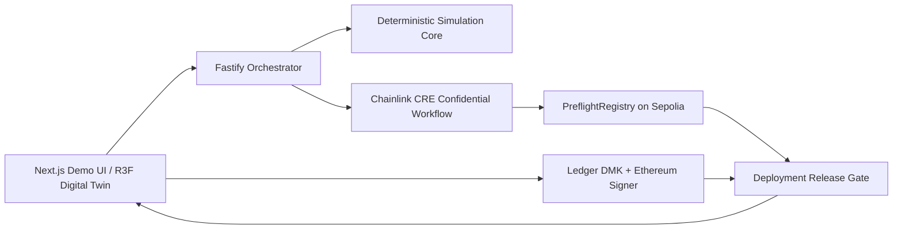

# Architecture Overview

## Layering

### `packages/domain`
Stable domain language and interfaces. No web, server, Chainlink, Ledger, or rendering dependencies.

### `packages/simulation-core`
Deterministic scenario/simulation interfaces and later implementation. No React. No network calls in deterministic verdict code.

### `integrations/chainlink-cre`
CRE-specific entrypoint and adapters. Must respect the CRE TypeScript WASM/QuickJS environment. Confidential inputs stay here.

### `contracts`
Minimal public attestation/release verification surface. No private safety envelope storage.

### `packages/ledger-gate`
Browser-only hardware approval boundary. Backend never holds a substitute release key.

### `apps/api`
Orchestration, public/non-confidential persistence, partner calls, demo coordination. Never becomes the safety authority.

### `apps/web`
Operator UI and digital-twin rendering. Rendering is a view of simulation state, not the source of truth.

## Intended release check
A release must eventually prove all of:
- attestation exists and is valid
- build digest matches clearance
- site commitment matches clearance
- evaluator version is allowed
- clearance has not expired/revoked
- Ledger-approved deployment intent binds the same identifiers

Implementation details remain intentionally open until their tasks are approved.
