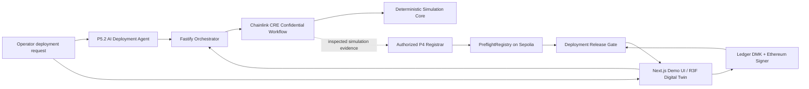

# Architecture Overview

## Layering

### `packages/domain`
Stable, versioned domain language and interfaces: canonical identifiers, exact protocol schemas, runtime validation, deterministic serialization/digests, and cross-object binding checks. No web, server, Chainlink, Ledger, or rendering dependencies. See ADR-0003.

### `packages/simulation-core`
Pure P2 fixed-unit warehouse model, committed seeded scenario generation, materialized-trace validation, and deterministic restricted-zone/speed/payload evaluation. The internal report wraps an unchanged P1 result. No React, partner, network, filesystem, clock, or environment dependency. See ADR-0004.

### `integrations/chainlink-cre`
P3 CRE-specific HTTP entrypoint and adapters. The real `handlerInTee` callback reads the private envelope/blind through one fixed CRE secret selector, invokes `@preflight/simulation-core`, and releases only an allowlisted P1 result plus the exact supplied-behavior binding. Authenticated evidence currently uses the local simulator's ignored environment mapping; production Vault DON custody remains unproven. The workflow compiles to the CRE WASM/QuickJS target without Node, filesystem, environment, dynamic-import, browser, or native runtime dependencies.

### `contracts`
P4 public attestation registry keyed by the P1 clearance digest. It stores only fixed-size exact
bindings, timestamps, issuer, and revocation state; owner-managed registrars attest the offchain P1
digest-to-field mapping. It has no private envelope data, canonical JSON parser, automatic CRE
delivery, signing, deployment authorization, enumeration, or upgradeability. See ADR-0006.
The unchanged P4 contract is source-verified on Ethereum Sepolia at
`0xFB270cc222efa8B5005AA097dD512Be2558dde65`; the public `chainId + verifyingContract` identity is
versioned in `contracts/deployments/sepolia.json` for later P5 domain binding. Its existence alone
does not authorize a deployment.

### `packages/ledger-gate`
P5 browser-only DMK/Ethereum Signer Kit adapter with production WebHID and development/test-only
loopback official Speculos transport. It confirms the Ethereum address on-device/emulator,
requests only the exact full EIP-712 `DeploymentIntent`, requires the Context Module to resolve all
15 exact display filters, normalizes device refusal, and cancels partial context or the signer kit's
legacy typed-data fallback. The backend never holds a substitute release key. Actual Speculos
transport/app/address UI smoke, actual pre-sign C, and invalid/unregistered D denial are evidenced;
authenticated Clear Signing A/B/E/F, revoked/expired D captures, and physical evidence remain
pending. See ADR-0007.

### `packages/chain-client`

P5 read-only Sepolia adapter and authorization protocol. It consumes the authoritative P4 deployment
artifact, maps exact P1 bindings to the deployed ABI, reads one consistent block, constructs the
fixed EIP-712 domain/message, and verifies recovered signatures.

### `apps/api`
P5 deterministic prepare/consume authority plus the P5.2 narrow tool-calling deployment agent. The
agent accepts only a finite catalog-generated public request grammar, discards raw input locally,
and sends a host-generated canonical public request to its strict provider abstraction. The
host-owned state machine locks canonical identifiers, inspects public evaluation/live registry
state, and invokes only the existing preparation authority. The model has no signing, consumption,
registry-write, arbitrary network, chain, signer, nonce, or payload capability. Model prose never
controls status; see ADR-0008.

The release service enforces the signer allowlist, checks exact live P4
state before and after signing, persists public request data and atomic one-time nonces in SQLite,
and emits a `ReleaseAuthorization` only after verification. This is an offchain single-node replay
boundary, not an onchain authorization claim. The API and agent never sign or receive private keys.

### `apps/web`
The root route is a product landing page. `/start` provides a short first-time setup for public site,
robot, and build labels, and `/app` provides the workspace shell with setup, build, evaluation,
release, and evidence views. `/app/evaluate` embeds the P6 deterministic warehouse digital twin,
public P2/P3 evaluation projection, public Sepolia registry identity, P5.2 activity boundary, and
Ledger human-approval state. The server computes the existing fixture projection; the browser never
receives the confidential envelope, blind, private rule data, or internal report. The digital twin
is explanatory and cannot decide clearance or authorization. A real prepared response from the
existing P5.2 API is required before the evaluation view hands the exact request to `/p5-ledger`.

The `/p5-ledger` route remains the separate minimal operator/evidence harness. It defaults to WebHID
and can select the loopback Ledger Speculos official device simulator only in development/test
without changing authorization semantics. It does not activate a robot. An explicit browser/user
action remains necessary, and physical Ledger evidence remains distinct from Speculos evidence.

## Intended release check
A release must eventually prove all of:
- attestation exists and is valid
- build digest matches clearance
- site commitment matches clearance
- evaluator version is allowed
- clearance has not expired/revoked
- Ledger-approved deployment intent binds the same identifiers

P1 defines canonical representation and binding vocabulary. P2 defines deterministic simulated
evaluation. P3 places that evaluation behind the confidential TEE boundary but neither authenticates
robot trace origin nor writes onchain. P4 records an authorized registrar's immutable public
clearance attestation and enforces exact binding, expiry, and revocation. P5 software adds an exact
full EIP-712 request, Ledger-only signing adapter, deterministic pre/post policy, signature recovery,
and durable one-time authorization. P5 remains open until physical Clear Signing cases A–F are
evidenced. P5.2 adds model-driven public orchestration but preserves those authorities: a valid
local deterministic fixture reaches the Ledger-required boundary in recorded evidence, a mutated
build loses to `CLEARANCE_BINDING_MISMATCH`, and only an already-consumed P5 nonce can be reported
as `AUTHORIZED`. P6 renders this evidence and the exact-build mutation story; it does not activate
a robot or create an onchain clearance.
