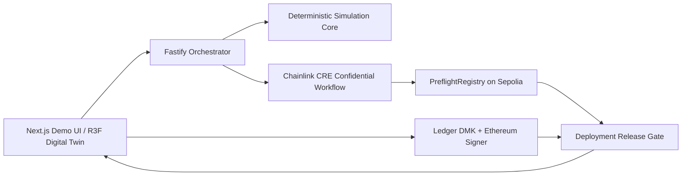

# Architecture Overview

## Layering

### `packages/domain`
Stable, versioned domain language and interfaces: canonical identifiers, exact protocol schemas, runtime validation, deterministic serialization/digests, and cross-object binding checks. No web, server, Chainlink, Ledger, or rendering dependencies. See ADR-0003.

### `packages/simulation-core`
Pure P2 fixed-unit warehouse model, committed seeded scenario generation, materialized-trace validation, and deterministic restricted-zone/speed/payload evaluation. The internal report wraps an unchanged P1 result. No React, partner, network, filesystem, clock, or environment dependency. See ADR-0004.

### `integrations/chainlink-cre`
CRE-specific entrypoint and adapters. Must respect the CRE TypeScript WASM/QuickJS environment. Confidential inputs stay here.

### `contracts`
Minimal public attestation/release verification surface. No private safety envelope storage.

### `packages/ledger-gate`
Browser-only hardware approval boundary. Backend never holds a substitute release key.

### `apps/api`
Orchestration, public/non-confidential persistence, partner calls, demo coordination. Never becomes the safety authority.

### `apps/web`
Operator UI and digital-twin rendering. Rendering is a view of simulation state, not the source of truth.

## Intended release check
A release must eventually prove all of:
- attestation exists and is valid
- build digest matches clearance
- site commitment matches clearance
- evaluator version is allowed
- clearance has not expired/revoked
- Ledger-approved deployment intent binds the same identifiers

P1 defines the canonical representation and binding vocabulary. P2 defines deterministic simulated evaluation only. Confidential execution, registry validity, signing, release authorization, and UI behavior remain open until their tasks are approved.
