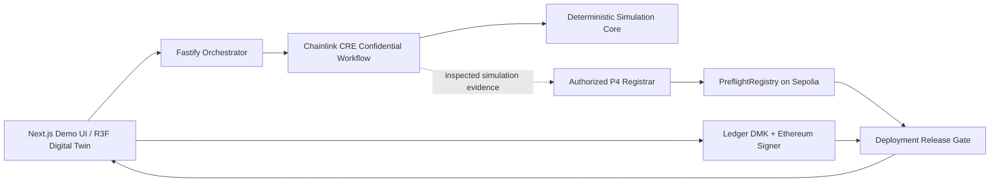

# Architecture Overview

## Layering

### `packages/domain`
Stable, versioned domain language and interfaces: canonical identifiers, exact protocol schemas, runtime validation, deterministic serialization/digests, and cross-object binding checks. No web, server, Chainlink, Ledger, or rendering dependencies. See ADR-0003.

### `packages/simulation-core`
Pure P2 fixed-unit warehouse model, committed seeded scenario generation, materialized-trace validation, and deterministic restricted-zone/speed/payload evaluation. The internal report wraps an unchanged P1 result. No React, partner, network, filesystem, clock, or environment dependency. See ADR-0004.

### `integrations/chainlink-cre`
P3 CRE-specific HTTP entrypoint and adapters. The real `handlerInTee` callback reads the private envelope/blind through one fixed CRE secret selector, invokes `@preflight/simulation-core`, and releases only an allowlisted P1 result plus the exact supplied-behavior binding. Authenticated evidence currently uses the local simulator's ignored environment mapping; production Vault DON custody remains unproven. The workflow compiles to the CRE WASM/QuickJS target without Node, filesystem, environment, dynamic-import, browser, or native runtime dependencies.

### `contracts`
P4 public attestation registry keyed by the P1 clearance digest. It stores only fixed-size exact
bindings, timestamps, issuer, and revocation state; owner-managed registrars attest the offchain P1
digest-to-field mapping. It has no private envelope data, canonical JSON parser, automatic CRE
delivery, signing, deployment authorization, enumeration, or upgradeability. See ADR-0006.
The unchanged P4 contract is source-verified on Ethereum Sepolia at
`0xFB270cc222efa8B5005AA097dD512Be2558dde65`; the public `chainId + verifyingContract` identity is
versioned in `contracts/deployments/sepolia.json` for later P5 domain binding. Its existence alone
does not authorize a deployment.

### `packages/ledger-gate`
Browser-only hardware approval boundary. Backend never holds a substitute release key.

### `apps/api`
Orchestration, public/non-confidential persistence, partner calls, demo coordination. Never becomes the safety authority.

### `apps/web`
Operator UI and digital-twin rendering. Rendering is a view of simulation state, not the source of truth.

## Intended release check
A release must eventually prove all of:
- attestation exists and is valid
- build digest matches clearance
- site commitment matches clearance
- evaluator version is allowed
- clearance has not expired/revoked
- Ledger-approved deployment intent binds the same identifiers

P1 defines canonical representation and binding vocabulary. P2 defines deterministic simulated
evaluation. P3 places that evaluation behind the confidential TEE boundary but neither authenticates
robot trace origin nor writes onchain. P4 records an authorized registrar's immutable public
clearance attestation and enforces exact binding, expiry, and revocation. Ledger signing, replay-safe
release authorization, and UI behavior remain open until their tasks are approved.
